# PicoPitch 🎯 - AI-Powered SaaS Opportunity Engine

**From Reddit Pain Points to AI-Built MVPs: Complete Agentic SaaS Pipeline**

PicoPitch is an **agentic workflow system** that transforms community discussions into production-ready development plans through a sophisticated multi-agent pipeline. It discovers and validates SaaS opportunities from Reddit, then generates AI Coding Agent-optimized documentation (BRDs, PRDs, and 1-point Agile plans) designed for autonomous MVP implementation via Vibe Coding in Cursor IDE using MCP servers.

## 🤖 Agentic Architecture

This system demonstrates **intelligent multi-agent orchestration** through specialized, autonomous agents:

### **Multi-Agent Orchestration**

- **Reddit Scraper Agent**: Autonomous community data collection
- **Gemini Analysis Agent**: AI-powered problem extraction and validation
- **Orchestrator Agent**: Workflow coordination and parallel processing
- **Documentation Agent**: Evidence-based technical documentation generation
- **Database Agent**: Persistent data management and retrieval

### **Agentic Design Principles**

- **🎯 Task Specialization**: Each agent has a focused, well-defined responsibility
- **🔄 Autonomous Decision Making**: Agents make independent judgments within their domain
- **📊 Evidence-Based Processing**: All decisions backed by quantifiable data
- **🤝 Agent Coordination**: Sophisticated handoffs between specialized agents
- **🔧 Self-Correcting Workflows**: Built-in error handling and retry mechanisms
- **📈 Iterative Improvement**: Continuous refinement through feedback loops

## 🎯 What PicoPitch Does

**The Complete SaaS Pipeline: From Community Pain → Autonomous MVP**

PicoPitch replaces this manual process:

```
💬 "I'm desperate! Just burned $75k on a developer who couldn't set up auth..."
   → 📊 Manual research → 📝 Generic docs → 👨‍💻 Manual development → 🤞 Hope it works
```

With this autonomous pipeline:

```
💬 Reddit Pain Points → 🤖 AI Analysis → 📊 Evidence Validation → 📋 Agent-Ready Docs → 🤖 Cursor AI Builds MVP
```

**The Magic: Vibe Coding with AI Agents**

1. **🔍 Discover**: Find real user problems from Reddit communities
2. **✅ Validate**: AI analyzes and scores opportunities with evidence
3. **📋 Plan**: Generate BRD, PRD, and granular Agile stories (1-point tasks)
4. **🤖 Build**: AI Coding Agent in Cursor autonomously implements using MCP servers
5. **🚀 Deploy**: Working MVP ready for user testing and iteration

### Real Output Example

Instead of generic assumptions, you get evidence-backed insights:

**Before (Generic):**

> "Technical hiring is challenging for non-technical founders"

**After (Evidence-Based):**

> **Pain Points (Validated by 47 Reddit Posts):**
>
> > "Just burned through $75k on a 'senior developer' who couldn't even set up basic authentication" - [u/frustrated_founder](https://reddit.com/r/startups/comments/xyz123) (234 upvotes)
>
> **Financial Impact**: 67% mentioned losses between $50k-$100k  
> **Urgency**: High (23% used words like "desperate", "urgent")

## 🔄 Agentic Workflow System

**PicoPitch implements a sophisticated agentic workflow where specialized agents collaborate autonomously:**

```mermaid
flowchart TD
    %% Agent Layer
    A[🤖 Reddit Scraper Agent<br/>Autonomous Data Collection] --> B[(🗄️ Database Agent<br/>Persistent Storage)]
    A --> A1[r/SideProject]
    A --> A2[r/startups]
    A --> A3[Custom Subreddits]

    %% Orchestrator Agent manages the pipeline
    O[🎭 Orchestrator Agent<br/>Workflow Coordination] --> C
    O --> D
    O --> F
    O --> G
    O --> H
    O --> I

    B --> C[🧠 Stage 1: Gemini Analysis Agent<br/>Enhanced Problem Extraction]
    C --> C1[Extract User Quotes]
    C --> C2[Financial Indicators]
    C --> C3[Urgency Analysis]

    C --> D[🔍 Stage 2: Pattern Recognition Agent<br/>Domain Grouping & Themes]
    D --> E[🎯 Theme Consolidation Agent]
    E --> E1[Gemini Pro Model]
    E1 --> E2[Canonical Business Themes]

    E2 --> F[💡 Stage 3: Opportunity Agent<br/>Evidence Aggregation]
    F --> F1[Market Validation Data]
    F --> F2[Pain Point Frequency]

    F --> G[⚖️ Stage 4: Validation Agent<br/>Autonomous Scoring]
    G --> G1[Monetization Score]
    G --> G2[Market Size Score]
    G --> G3[Feasibility Score]
    G --> G4[🚦 Go/No-Go Decision]

    G4 --> H[💭 Stage 5: Solution Agent<br/>Concept Generation]
    H --> H1[Multiple Solution Concepts]
    H1 --> H2[🎯 Auto-Select Best Concept]

    H2 --> I[📝 Stage 6: Documentation Agent<br/>Technical Spec Generation]
    I --> I1[Evidence-Based BRD]
    I --> I2[Technical PRD]
    I --> I3[1-Point Agile Plan]

    I1 --> J[📁 Local File System<br/>AI-Ready Documentation]
    I2 --> J
    I3 --> J

    J --> M[🤖 Stage 7: External AI Agent<br/>Cursor IDE Integration]
    M --> M1[AI Coding Agent]
    M1 --> M2[🔌 MCP Servers<br/>Supabase, Context7, Stripe]
    M2 --> M3[🏗️ Autonomous MVP Development]
    M3 --> N[🚀 Production-Ready MVP]

    %% AI Model Agents
    K[⚡ Gemini Flash Agent<br/>High-Speed Processing] -.-> C
    L[🧠 Gemini Pro Agent<br/>Deep Analysis] -.-> E1
    L -.-> F
    L -.-> G
    L -.-> H
    L -.-> I

    %% Agent styling
    style A fill:#e1f5fe
    style B fill:#f3e5f5
    style O fill:#fff9c4
    style J fill:#e8f5e8
    style K fill:#fff3e0
    style L fill:#fff3e0
    style M fill:#f0f4ff
    style N fill:#e6ffed
```



### **Agentic Collaboration Patterns**

**🎭 Orchestrator Agent** - Master coordinator implementing:

- **Parallel execution** across specialized agents
- **Error handling** and retry mechanisms
- **State management** between agent handoffs
- **Quality gates** at each stage transition

**🤖 Specialized Processing Agents** - Each with autonomous decision-making:

- **Reddit Agent**: Content relevance filtering
- **Analysis Agent**: Problem significance scoring
- **Validation Agent**: Market opportunity assessment
- **Documentation Agent**: Technical specification generation

## 🎓 Agentic Best Practices Implemented

PicoPitch demonstrates **production-ready implementation** of modern patterns for building reliable agentic systems:

### **1. Clear Agent Boundaries & Responsibilities**

```python
# Each agent has a single, well-defined purpose
class RedditScraperAgent:
    """Autonomous Reddit data collection with built-in rate limiting"""

class GeminiAnalysisAgent:
    """Problem extraction and validation with evidence scoring"""

class OrchestatorAgent:
    """Workflow coordination with error handling and state management"""
```

### **2. Robust Error Handling & Recovery**

- **Exponential backoff** for API rate limits
- **Graceful degradation** when external services fail
- **State persistence** for workflow resume after interruptions
- **Validation checkpoints** at each agent handoff

### **3. Evidence-Based Decision Making**

```python
# All agent decisions backed by quantifiable metrics
validation_scores = {
    "monetization_potential": evidence_based_score(financial_indicators),
    "market_size": calculate_from_post_frequency(aggregated_data),
    "feasibility": technical_complexity_analysis(requirements)
}
```

### **4. Parallel Processing & Efficiency**

- **Concurrent agent execution** using ThreadPoolExecutor
- **Batch processing** for API efficiency
- **Smart caching** to avoid redundant AI calls
- **Resource optimization** across the agent pipeline

### **5. Human-AI Collaboration Design**

- **Transparent decision trails** - every recommendation includes evidence
- **Configurable thresholds** for human oversight and control
- **Rich context preservation** - full audit trail from Reddit post to final spec
- **Quality gates** where human review can be injected

### **6. Production-Ready Architecture**

- **Database persistence** for workflow state and results
- **API integration patterns** with proper retry logic
- **Modular design** allowing individual agent replacement/upgrade
- **Documentation generation** optimized for downstream AI agents

## ✨ Key Features

### 🔍 **Intelligent Problem Extraction**

- Analyzes Reddit posts/comments for genuine user pain points
- Extracts direct quotes preserving authentic user language
- Identifies financial indicators (budgets, losses, willingness to pay)
- Assesses urgency levels and emotional intensity

### 🎯 **Market Validation**

- Aggregates evidence across multiple posts
- Calculates pain point frequency and market size indicators
- Tracks competitor mentions and gaps
- Generates validation scores for opportunities

### 📊 **AI Coding Agent-Optimized Documentation**

- **Business Requirements Documents (BRDs)** with real user quotes and market validation
- **Technical PRDs** optimized for Next.js, Supabase, Clerk tech stack via MCP servers
- **1-Point Agile Plans** with granular Epics → Stories → Tasks → Subtasks for autonomous implementation
- **Vibe Coding Ready**: All documents formatted for AI Coding Agents in Cursor IDE
- **Source Citations**: Every requirement traced back to actual Reddit discussions

### 🤖 **Dual AI Model Strategy**

- **Gemini 2.5 Flash 05-20**: High-speed processing for bulk lead analysis
- **Gemini 2.5 Pro 06-05**: Deep thinking for opportunity validation and document generation

### 🔧 **MCP Server Integration Ready**

Generated Agile plans include specific MCP server integrations:

- **Supabase MCP**: Database setup, table creation, authentication
- **Context7 MCP**: Latest framework documentation and best practices
- **Stripe MCP**: Payment processing and subscription management
- **GitHub MCP**: Repository creation and deployment workflows

## 🚀 Quick Start

### Prerequisites

- Python 3.8+
- [Google Gemini API key](https://makersuite.google.com/app/apikey)
- [Reddit API credentials](https://www.reddit.com/prefs/apps)
- [Supabase account](https://supabase.com) (free tier works)

### 1. Clone & Setup

```bash
git clone <your-repo-url>
cd pico-pitch
python3 -m venv venv
source venv/bin/activate  # On Windows: venv\Scripts\activate
pip install -r requirements.txt
```

### 2. Environment Configuration

Create a `.env` file with your API credentials:

```env
# Google Gemini API
GEMINI_API_KEY=your_gemini_api_key_here

# Reddit API (create app at https://www.reddit.com/prefs/apps)
REDDIT_CLIENT_ID=your_reddit_client_id
REDDIT_CLIENT_SECRET=your_reddit_client_secret
REDDIT_USER_AGENT=PicoPitch:v1.0 (by /u/yourusername)

# Supabase (create project at https://supabase.com)
SUPABASE_URL=https://your-project.supabase.co
SUPABASE_KEY=your_service_role_key_here
```

### 3. Database Setup

#### Option A: Automatic Setup (Recommended)

The system will automatically create the required tables on first run. Just make sure your Supabase service role key has the necessary permissions.

#### Option B: Manual Setup

If you prefer to set up the database manually, create the following tables in your Supabase project:

<details>
<summary>📋 Click to view SQL schema</summary>

```sql
-- Create raw_leads table
CREATE TABLE raw_leads (
    id BIGSERIAL PRIMARY KEY,
    reddit_id TEXT NOT NULL UNIQUE,
    permalink TEXT,
    subreddit TEXT,
    title TEXT,
    body_text TEXT,
    is_comment BOOLEAN NOT NULL,
    scraped_at TIMESTAMP WITH TIME ZONE DEFAULT NOW(),
    status TEXT DEFAULT 'new_raw_lead',
    gemini_problem_summary TEXT,
    gemini_problem_domain TEXT,
    gemini_saas_potential_flag TEXT,
    gemini_frustration_level TEXT,
    enhanced_analysis JSONB,
    has_evidence BOOLEAN DEFAULT FALSE,
    author TEXT,
    score INTEGER DEFAULT 0,
    num_comments INTEGER DEFAULT 0,
    created_utc INTEGER,
    url TEXT
);

-- Create opportunities table
CREATE TABLE opportunities (
    id BIGSERIAL PRIMARY KEY,
    based_on_lead_ids BIGINT[],
    title TEXT,
    problem_summary_consolidated TEXT,
    opportunity_description_ai TEXT,
    target_user_ai TEXT,
    value_proposition_ai TEXT,
    domain_relevance_ai TEXT,
    status TEXT DEFAULT 'opportunity_defined',
    selected_solution_concept_json JSONB,
    created_at TIMESTAMP WITH TIME ZONE DEFAULT NOW(),
    monetization_score INTEGER,
    market_size_score INTEGER,
    feasibility_score INTEGER,
    recommendation TEXT,
    justification TEXT,
    evidence_json JSONB DEFAULT '{}',
    total_posts_analyzed INTEGER DEFAULT 0,
    pain_point_frequency INTEGER DEFAULT 0
);

-- Create solution_concepts table
CREATE TABLE solution_concepts (
    id BIGSERIAL PRIMARY KEY,
    opportunity_id BIGINT REFERENCES opportunities(id),
    concept_name TEXT,
    core_features_json JSONB,
    ai_generated_at TIMESTAMP WITH TIME ZONE DEFAULT NOW()
);

-- Create documents table
CREATE TABLE documents (
    id BIGSERIAL PRIMARY KEY,
    opportunity_id BIGINT REFERENCES opportunities(id),
    document_type TEXT NOT NULL,
    content_markdown TEXT,
    version INTEGER DEFAULT 1,
    created_at TIMESTAMP WITH TIME ZONE DEFAULT NOW(),
    last_updated_at TIMESTAMP WITH TIME ZONE DEFAULT NOW(),
    local_file_path TEXT
);

-- Create indexes for better performance
CREATE INDEX idx_raw_leads_status ON raw_leads(status);
CREATE INDEX idx_raw_leads_reddit_id ON raw_leads(reddit_id);
CREATE INDEX idx_opportunities_status ON opportunities(status);
CREATE INDEX idx_solution_concepts_opportunity_id ON solution_concepts(opportunity_id);
CREATE INDEX idx_documents_opportunity_id ON documents(opportunity_id);
```

</details>

**Database Structure:**

- **`raw_leads`**: Stores Reddit posts/comments with AI analysis
- **`opportunities`**: Validated business opportunities with evidence data
- **`solution_concepts`**: Multiple solution ideas per opportunity
- **`documents`**: Generated BRDs, PRDs, and Agile plans

**Permissions Required:**
Your Supabase service role key needs `INSERT`, `UPDATE`, `SELECT` permissions on all tables.

**Security Note:**
PicoPitch is designed as a personal tool and currently runs without Row Level Security (RLS). If you plan to add authentication or share access, consider enabling RLS policies on your tables.

### 4. Run the System

```bash
# Full run (scrape + analyze)
./run_app.sh

# Skip scraping, just analyze existing data
./run_app.sh --skip-scraper

# Custom subreddits and limits
python3 reddit_scraper_agent.py startups SideProject entrepreneur --limit 100 --comments 50
```

## 📁 Output Structure

PicoPitch generates organized outputs:

```
picopitch_outputs/
├── opportunity_1_Technical_Hiring_Crisis/
│   ├── BRD_v1.md           # Business Requirements Document
│   ├── PRD_v1.md           # Product Requirements Document
│   └── AGILE_PLAN_v1.md    # Detailed development plan
├── opportunity_2_Customer_Support_Automation/
│   ├── BRD_v1.md
│   ├── PRD_v1.md
│   └── AGILE_PLAN_v1.md
└── ...
```

Each opportunity includes:

- **🎯 Evidence-backed market validation** with real user data
- **💬 Authentic user quotes** with Reddit source links
- **💰 Financial impact analysis** from community discussions
- **🤖 AI Coding Agent-ready plans** for autonomous implementation
- **📋 1-point Agile breakdown** (Epics → Stories → Tasks → Subtasks)
- **🔧 MCP server integration** (Supabase, Context7, Stripe, etc.)

## ⚙️ Configuration Options

### Subreddit Targeting

Edit `run_app.sh` to customize which communities to analyze:

```bash
SUBREDDITS_TO_SCRAPE=("SideProject" "startups" "entrepreneur" "webdev")
POST_LIMIT=50
COMMENT_LIMIT=30
```

### AI Model Selection

In `orchestrator.py`:

```python
# Fast model for bulk processing
FLASH_MODEL_NAME = "gemini-2.5-flash-preview-05-20"

# Powerful model for critical analysis
PRO_MODEL_NAME = "gemini-2.5-pro-preview-06-05"

# Toggle evidence-based extraction
USE_ENHANCED_EXTRACTION = True
```

### Quality Thresholds

```python
# Minimum posts needed to form a business opportunity
MIN_LEADS_FOR_THEME = 3
```

## 🏗️ System Architecture

### Core Components

| Component            | Purpose                                   | Technology                |
| -------------------- | ----------------------------------------- | ------------------------- |
| **Reddit Scraper**   | Data collection from communities          | PRAW (Python Reddit API)  |
| **Orchestrator**     | Workflow management & parallel processing | Python ThreadPoolExecutor |
| **Gemini Agent**     | AI analysis & document generation         | Google Gemini API         |
| **Database Manager** | Data persistence & retrieval              | Supabase PostgreSQL       |
| **File Exporter**    | Local document generation                 | Python file operations    |

### Data Flow

1. **Ingestion**: Reddit posts/comments → Supabase raw_leads table
2. **Analysis**: Gemini extracts problems → Enhanced analysis with evidence
3. **Grouping**: Similar problems → Consolidated themes
4. **Validation**: Theme → Scored business opportunity
5. **Documentation**: Opportunity → BRD/PRD/Agile plans
6. **Implementation**: AI Coding Agent + MCP servers → Autonomous MVP development

## 📊 Performance & Scaling

- **Parallel Processing**: All stages use concurrent execution
- **Rate Limiting**: Built-in retry logic for API limits
- **Batch Operations**: Efficient database operations
- **Memory Efficient**: Streaming data processing

Typical performance:

- **50 posts**: ~2-3 minutes end-to-end
- **500 posts**: ~15-20 minutes end-to-end
- **Cost**: ~$0.10-0.50 per 100 posts (Gemini API)

## 🤝 Contributing & Customization

### Adding New Data Sources

Extend beyond Reddit by implementing additional scrapers:

```python
# Example: HackerNews scraper
def scrape_hackernews(limit=50):
    # Implementation here
    pass
```

### Custom Analysis Prompts

Modify prompts in `gemini_interaction_agent.py` for domain-specific analysis:

- `get_enhanced_problem_extraction_prompt()`: Problem identification
- `get_opportunity_validation_prompt()`: Validation criteria
- `get_enhanced_brd_drafter_prompt()`: Document generation

### Integration Options

- **Webhook support**: Notify external systems of new opportunities
- **API wrapper**: Expose functionality via REST API
- **Dashboard**: Build frontend for opportunity management

## 🔧 Troubleshooting

### Common Issues

**API Rate Limits**

```
✅ Built-in retry logic with exponential backoff
✅ Separate models for different workloads
```

**Database Connection Issues**

```bash
# Test your Supabase connection
python3 database_manager.py

# If tables don't exist, the system will try to create them automatically
# Check Supabase logs if you see permission errors
```

**First Run Issues**

- Ensure your service role key (not anon key) is in the .env file
- Verify your Supabase project URL is correct
- Check that your Supabase project is not paused

**JSON Parsing Errors**

```
✅ Robust JSON cleaning for Gemini responses
✅ Graceful fallbacks for malformed data
```

**No Opportunities Generated**

- Check if `MIN_LEADS_FOR_THEME` threshold is too high
- Verify Reddit data contains clear problem statements
- Review Supabase logs for processing errors

## 📈 Roadmap

- [ ] **Multi-source ingestion** (HackerNews, forums, Twitter)
- [ ] **Real-time processing** with webhook triggers
- [ ] **Competitive analysis** integration
- [ ] **Market size estimation** with external data
- [ ] **Investment thesis** generation
- [ ] **Next.js dashboard** for opportunity management

## 📄 License

MIT License - Feel free to fork, modify, and share!

## 👨‍💻 Author

**Darren Head** - Creator and maintainer  
🔗 [GitHub](https://github.com/darrenhead) | 🌐 Building the future of agentic workflows

## 🙏 Acknowledgments

Built with **modern agentic workflow patterns** and powered by:

### **Core Technologies**

- [**Claude (Anthropic)**](https://claude.ai) - AI-powered analysis and content generation
- [**Google Gemini**](https://gemini.google.com) - AI analysis with flash and pro model orchestration
- [**PRAW**](https://github.com/praw-dev/praw) - Reddit API integration for community data collection
- [**Supabase**](https://supabase.com) - Database & backend with real-time capabilities
- [**Python**](https://python.org) - Multi-agent orchestration and parallel processing

### **Agentic Architecture Inspiration**

- **Multi-Agent System Patterns** - Task specialization and autonomous coordination
- **Evidence-Based AI Systems** - Quantifiable decision making and transparency
- **Human-AI Collaboration Design** - Configurable oversight and quality gates

### **Development Tools**

- [**Cursor IDE**](https://cursor.sh) - AI-powered development environment
- **MCP Servers** - Model Context Protocol for seamless AI integration
- **GitHub Copilot** - AI pair programming assistance

---

## 🚀 Get Started Today

**Ready to go from Reddit pain points to working MVP using agentic workflows?**

```bash
git clone https://github.com/darrenhead/pico-pitch.git
cd pico-pitch
./run_app.sh
```

Let PicoPitch's **autonomous agent pipeline** transform real user problems into AI Coding Agent-ready documentation. Then feed the generated BRD, PRD, and Agile plan to your AI Coding Agent in Cursor for autonomous MVP development via Vibe Coding.

### **The Agentic Future of SaaS Development:**

**Evidence-driven opportunities + intelligent agent orchestration + AI-powered implementation = Validated MVPs in record time.**

---

_Built with ❤️ using modern agentic workflow patterns_
